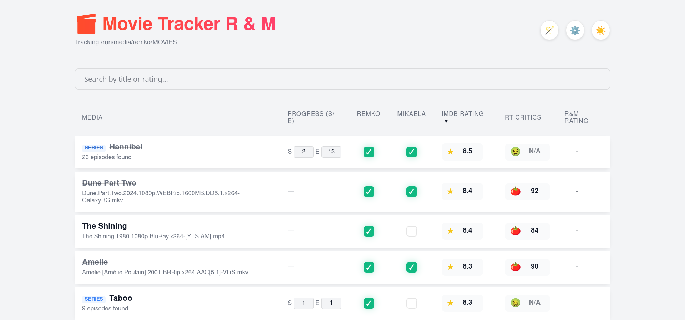
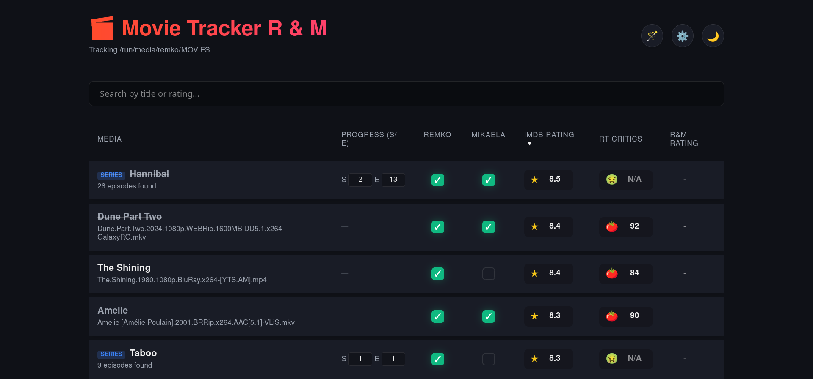
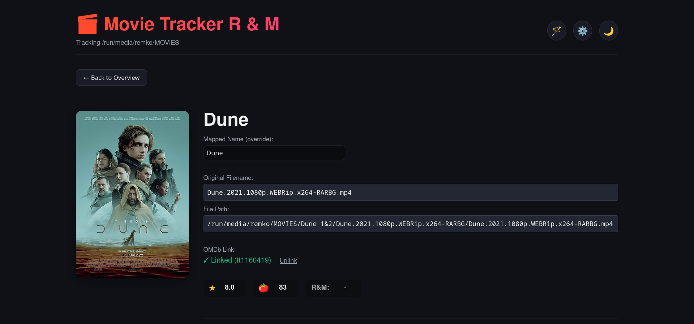
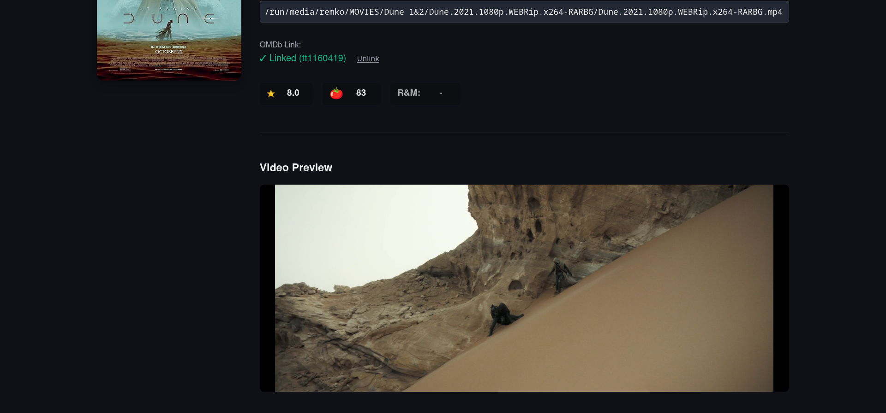

# Movie Tracker

A lightweight, modern web interface to track your watched movies and TV series across different platforms. It scans a designated folder on your hard drive for video files and presents them in a beautiful, dynamic UI.

## Quick Start
Get up and running in seconds:
1. **Download the app**: Click the green "Code" button at the top of this page, select "Download ZIP", and extract it to a folder on your computer.
2. **Double-click the start script** for your OS (`start-windows.bat`, `start-macos.command`, or `start-linux.sh`) to launch the local server. (Python 3 must be installed).
3. **Open your browser** and navigate to `http://localhost:8080`.
4. **Configure the app** by clicking the ⚙️ Settings icon in the top right to set your movie folder path and OMDb API key.

## Features
- **Cross-Platform**: Works out of the box on Windows, Mac, and Linux.
- **In-App Settings**: Change the tracking folder path and custom usernames directly from the UI without touching the code.
- **Details View**: Click any title to see its IMDb and Rotten Tomatoes ratings, plus an editable custom canonical name.
- **Video Previews**: Play and scrub through movie files directly within the browser using the built-in video player in the details view.
- **Auto-Fetch Ratings**: Connect a free OMDb API key in Settings to instantly fetch missing IMDb and Rotten Tomatoes ratings with the Magic Wand button.
- **Movie & Series Posters**: Automatically downloads high-resolution cover art from OMDb, displaying sleek thumbnails in the main list and full posters in the details view.
- **Smart Linking**: Manually search OMDb within the Details view and link movies to their exact official database IDs for perfect accuracy.
- **Safe Saving**: Click into any field to edit; a small `💾` Save button appears (with a delayed auto-hide) so you never lose progress, or just hit `Enter` to quick-save.
- **Series Tracking**: Automatically detects TV series, tracks seasons/episodes, and lists available episodes.
- **Custom Joint Rating**: Assign a joint rating (e.g., R&M Rating) for any watched media, which dynamically updates based on your names in Settings.
- **Dark/Light Mode**: Toggle between premium dark and clean light mode.

## Configuration & Settings

You can customize the app at any time by clicking the gear icon (⚙️) in the top right corner. These settings update the app instantly without needing to touch any code:

- **Movies Folder Path**: The absolute path to the directory where your media files are stored. The app scans this folder and all its subfolders for video files.
- **User 1 Name & User 2 Name**: Personalize the tracker for two people. Updating these names instantly renames your progress checkbox columns and automatically updates the joint rating abbreviation across the app (e.g. changing Remko & Mikaela to John & Sarah automatically updates the `R&M Rating` header to `J&S Rating`).
- **OMDb API Key**: (Optional) Add your personal API key from OMDb. This activates the Magic Wand auto-fetch tool and manual Smart Linking to seamlessly pull down official ratings and beautiful high-res posters for your library.

## Screenshots

<p align="center">
  <a href="screenshots/light_overview.png" target="_blank"></a>
  <a href="screenshots/dark_overview.png" target="_blank"></a>
  <br>
  <a href="screenshots/dark_details.png" target="_blank"></a>
  <a href="screenshots/dark_video.png" target="_blank"></a>
</p>

---

## Prerequisites
- **Python 3.x**: Ensure Python is installed on your system. You can check by running `python --version` or `python3 --version` in your terminal/command prompt.

---

## How to Start

### Windows

**Start**
1. Open the folder containing the app in File Explorer.
2. Double-click the `start-windows.bat` file.
3. Your web browser will open automatically. *(If it doesn't, go to `http://localhost:8080`)*

**Fallback: Using Terminal**
1. Open PowerShell or Command Prompt.
2. Navigate to the folder containing the app.
3. Run the startup script:
   ```powershell
   .\start-powershell.ps1
   ```
   *(Alternatively, you can just run `python app.py`)*
4. Your web browser will open automatically. *(If it doesn't, go to `http://localhost:8080`)*

### macOS

**Start**
1. Open the folder containing the app in Finder.
2. Double-click the `start-macos.command` file.
3. Your web browser will open automatically. *(If it doesn't, go to `http://localhost:8080`)*

**Fallback: Using Terminal**
1. Open Terminal.
2. Navigate to the folder containing the app.
3. Make the script executable (only needed the first time):
   ```bash
   chmod +x start-macos.command
   ```
4. Run the startup script:
   ```bash
   ./start-macos.command
   ```
   *(Alternatively, you can just run `python3 app.py`)*
5. Your web browser will open automatically. *(If it doesn't, go to `http://localhost:8080`)*

### Linux

**Start**
1. Open the folder containing the app in your file manager.
2. Double-click the `start-linux.sh` file.
3. Your web browser will open automatically. *(If it doesn't, go to `http://localhost:8080`)*

**Fallback: Using Terminal**
1. Open Terminal.
2. Navigate to the folder containing the app.
3. Make the script executable (only needed the first time):
   ```bash
   chmod +x start-linux.sh
   ```
4. Run the startup script:
   ```bash
   ./start-linux.sh
   ```
   *(Alternatively, you can just run `python3 app.py`)*
5. Your web browser will open automatically. *(If it doesn't, go to `http://localhost:8080`)*

---

## First-Time Setup
1. Once the app is running, open it in your browser (`http://localhost:8080`).
2. Click the **⚙️ Settings** icon in the top right corner.
3. **Movies Folder Path**: Enter the absolute path to your movies folder.
   - *Windows Example*: `C:\Users\Username\Videos\Movies`
   - *Mac Example*: `/Users/Username/Videos/Movies`
   - *Linux Example*: `/home/Username/Videos/Movies`
4. **User Names**: Update "User 1" and "User 2" to your preferred names.
5. **OMDb API Key (Optional)**: To enable automatic rating fetch (the magic wand button), get a free API key from [omdbapi.com](http://www.omdbapi.com/apikey.aspx) and paste it here.
6. Click **Save Settings**. The app will immediately begin scanning your designated folder and populate the tracker!

## Troubleshooting
- **No movies showing up?** Ensure your folder path in Settings is exactly correct and that you have `.mp4`, `.mkv`, or `.avi` files larger than 150MB in that directory.
- **Port already in use?** If port 8080 is taken, open `app.py` in a text editor and change `PORT = 8080` to another number, like `8081`.
